# `cargo-uniflash`

A cargo subcommand for flashing ELF binaries onto TI processors with [TI UniFlash].

<p align="center">
  
</p>

[TI UniFlash]: https://www.ti.com/tool/UNIFLASH

## Installation

`cargo-uniflash` can be installed with cargo itself:

```
cargo install cargo-uniflash
```

If you do not already have TI UniFlash installed, `cargo-uniflash` will
optionally install it for you the first time it's run.

If you would prefer to install TI UniFlash manually, ensure that `dslite` or
`dslite.sh` are executables in your PATH for Mac/Linux, or `dslite.bat` in
Windows.

> **Warning**
>
> `cargo-uniflash` should work in Windows and Linux but these have not been
> tested yet. If you experience any issues, or everything works correctly,
> please let me know!

## Usage

You can use `cargo-uniflash` exactly like `cargo build`, passing any arguments
to it after a `--` separator:

```
cargo uniflash <cargo-build-args> -- <cargo-uniflash-args>
```

This will compile then flash your firmware.

Default options can be set via environment variables. These are always overridden
by options on the command line.

It's also possible to use `cargo-uniflash` to flash pre-compiled ELF images. In
this case `cargo-uniflash` will skip compilation and jump straight into flashing.
This allows it to be used as a [cargo runner], if you would prefer.

[cargo runner]: https://doc.rust-lang.org/cargo/reference/config.html#targettriplerunner

## Examples

* Compile firmware in release mode and flash it onto a [LAUNCHXL-RM42] dev kit:

  ```
  cargo uniflash --release -- --board launchxl-rm42
  ```

  Or:

  ```
  export CARGO_UNIFLASH_BOARD="launchxl-rm42"
  cargo uniflash --release
  ```

  Or install `cargo-uniflash` as a cargo runner by configuring `.cargo/config.toml`:

  ```
  [build]
  target = "armv7r-none-eabi

  [target.armv7-none-eabi]
  runner = ["cargo", "uniflash", "--", "--board", "launchxl-rm42", "--elf"]
  ```

  Then to flash your firmware:

  ```
  cargo run
  ```

* List all built-in boards:

  ```
  cargo uniflash -- --list-boards
  ```

* Compile firmware and flash it onto a custom target:

  ```
  cargo uniflash -- --custom-config=path/to/target.ccxml
  ```

[LAUNCHXL-RM42]: https://www.ti.com/tool/LAUNCHXL-RM42

## Troubleshooting

> TI UniFlash does not appear to be installed, want me to install it for you? [y/n]

If you keep seeing this message make sure that `dslite.sh` or `dslite.bat` (Mac/Linux and Windows
respectively) can be found on your PATH.

> Failed: Operation was aborted

`cargo-uniflash` can't find your debug probe.

> Failed: File: <firmware.elf>: a data verification error occurred, file load failed.

The `--verify` argument was specified but verification failed. Double check the map file for your
firmware.

## Uninstallation

To uninstall `cargo-uniflash`:

```
cargo uninstall cargo-uniflash
```

If you have used `cargo-uniflash` to download TI UniFlash, you may also wish
to manually uninstall it.

In Mac/Linux this can be done by running the `installScript.sh` script under the
`uninstall.app` directory of the UniFlash installation.

## Contribution

PR's welcome -- if `cargo-uniflash` doesn't already support a board you want to
use please submit a PR!

Unless you explicitly state otherwise, any contribution intentionally submitted
for inclusion in the work by you, as defined in the Apache-2.0 license, shall
be dual licensed as above, without any additional terms or conditions.
